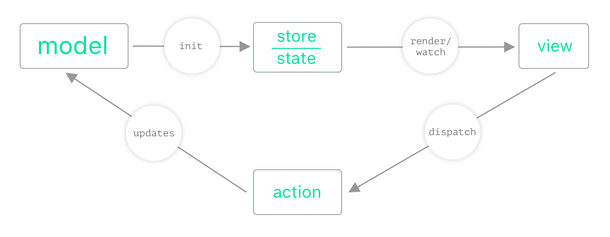

Prodo is a web framework that enables you to write performant and scalable web
apps with as little boilerplate as possible. It was designed with TypeScript in
mind and even includes a babel plugin to further reduce the amount of
boilerplate.

# Index

- [Setup](#setup)
- [Basic example](#basic-example)
  - [Specifying the model](#1.-specifying-the-model)
  - [Defining actions](#2.-defining-actions)
  - [React components](#3.-react-components)
- [Creating the store](#creating-the-store)
- [Running your application](#running-your-application)

# Setup

The easiest way to get started with Prodo is with
[create-prodo-app](/introduction/create-prodo-app). We also recommend using TypeScript.

```shell
# init
yarn create prodo-app my-app --typescript
# OR npx create-prodo-app my-app --typescript

# install
cd my-app
yarn

# start
yarn start
```

Navigate to [localhost:8080](http://localhost:8080) and you should see "Hello World".

# Basic Example

This section walks you through the main concepts of Prodo. We are creating a
simple "Counter" app, assuming basic knowledge of
[ES6](https://www.w3schools.com/js/js_es6.asp) and [React](https://reactjs.org).
The following example assumes you have cloned the starting template. All code
snippets use the babel plugin.

The typical workflow in developing a Prodo app is to

1. **Specify a model, specifying the types (if you want to use TypeScript)**
2. **Define your actions as simple functions mutating the state of your model**
3. **Use functional React components to render the model in its current state**

<br/><br/>
The diagram below gives you an overview of how Prodo's architecture works. We will go through each of the steps in more detail in the following sections.



<br/><br/>

## 1. Specifying the Model

The [model](/basics/model) holds all of the types used in your actions and components
in a file called `src/model.ts`.

```ts
import { createModel } from "@prodo/core";

export interface State {
  count: number;
}

export const model = createModel<State>();
export const { state, watch, dispatch } = model.ctx;
```

Here, the state contains a single `count` value. We then create our model with this state type
and export any variables from our model that are used elsewhere in our app.
These variables that are exported from our model are correctly typed with our
state.

## 2. Defining Actions

[Actions](/basics/actions) are simple functions that can read from the state and write to the state. They can
take arguments, trigger side effects (see [effect plugin](/plugins/effects)), and dispatch other actions (see [dispatch](/basics/actions#dispatch)). We can create
an action in the `src/App.tsx` file.

```tsx
import { state, dispatch } from "./model";

const changeCount = (amount: number) => {
  state.count += amount;
};
```

This action changes the count in our state by a specified amount. This action can
be triggered in a component or another action with the `dispatch` function.

```ts
dispatch(changeCount)(1);
```

## 3. React Components

[Components](/basics/components) take the state of your application and render it as JSX. Those components are writen with React and let you automatically "watch" for changes to the state. Under the hood, the component will start a subscription to the corresponding state path and trigger a re-render whenever the value changes.

```tsx
import { state, watch } from "./model";

const App = () => (
  <div>
    <h1>{watch(state.count)}</h1>
  </div>
);
```

Here we simply show the the `state.count` value.

Components can also trigger actions. Lets create two buttons to increment and
decrement the counter using the action we defined above.

```tsx
import { state, dispatch, watch } from "./model";

const App = () => (
  <div>
    <button onClick={() => dispatch(changeCount)(-1)}>-</button>
    <h1>{watch(state.count)}</h1>
    <button onClick={() => dispatch(changeCount)(1)}>+</button>
  </div>
);
```

After the above change the full `src/App.tsx` file is,

```tsx
import * as React from "react";
import { state, dispatch, watch } from "./model";

const changeCount = (amount: number) => {
  state.count += amount;
};

const App = () => (
  <div>
    <button onClick={() => dispatch(changeCount)(-1)}>-</button>
    <h1>{watch(state.count)}</h1>
    <button onClick={() => dispatch(changeCount)(1)}>+</button>
  </div>
);

export default App;
```

## Creating the Store

When starting your app, you need to create a [store](/basics/store) with your
app's initial state. We then wrap the application into a [Provider](/api-reference/provider) to make
this store accessible in all of the components.

This is done in `src/index.tsx`.

```tsx
import * as React from "react";
import * as ReactDOM from "react-dom";
import App from "./App";
import { model } from "./model";

const { Provider } = model.createStore({
  initState: {
    count: 0,
  },
});

ReactDOM.render(
  <Provider>
    <App />
  </Provider>,
  document.getElementById("root"),
);
```

## Running your Application

Run `yarn start` or `npm start` to start your application.
